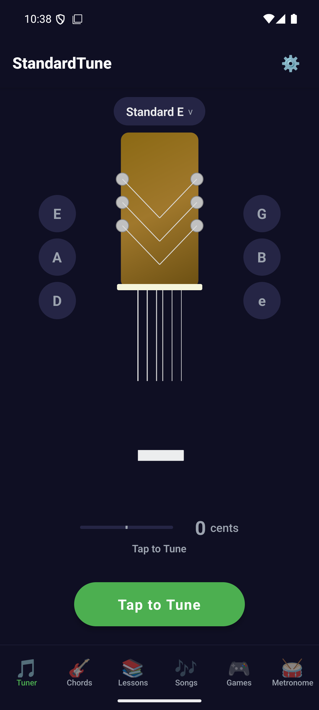
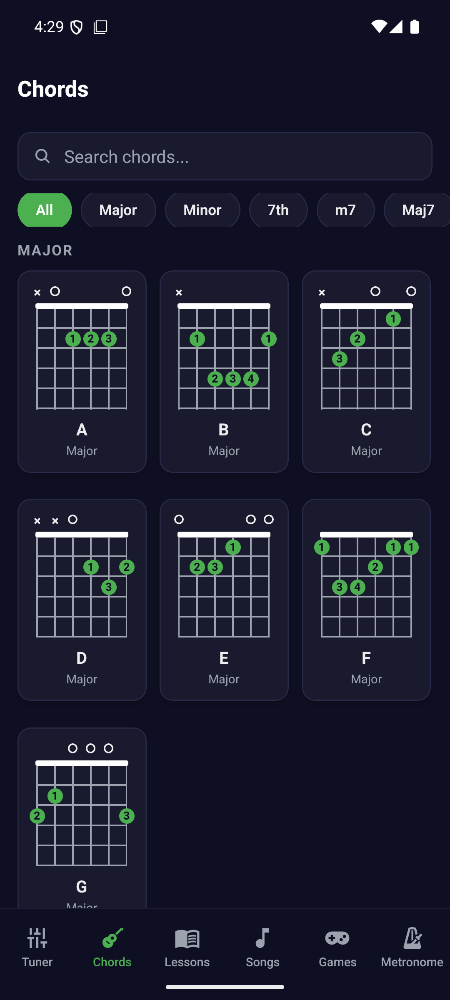
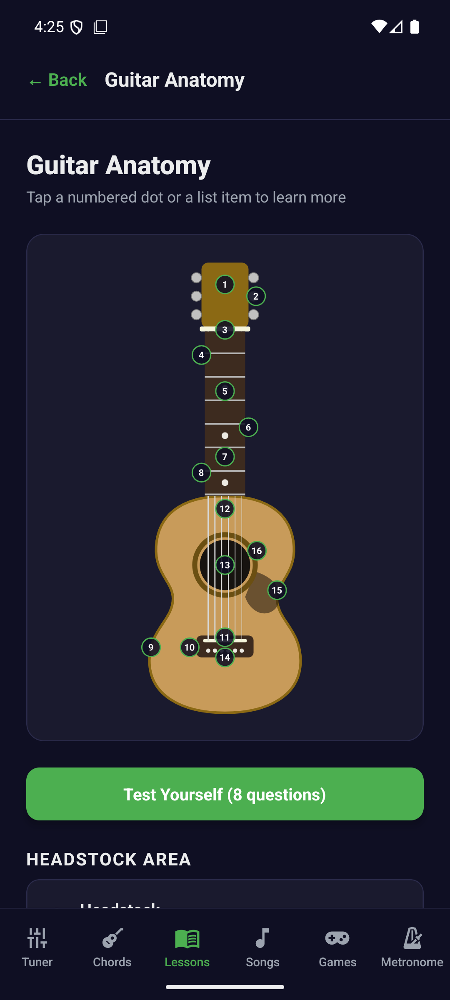
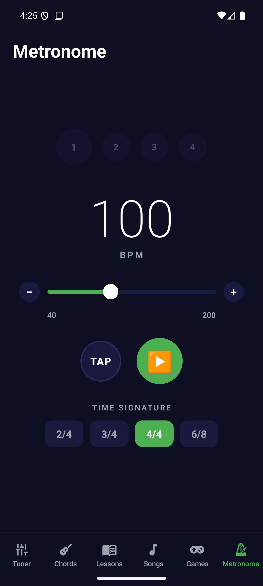
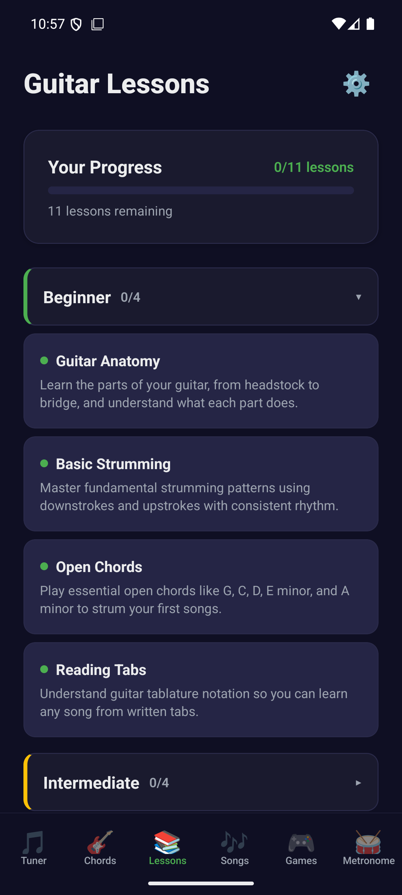
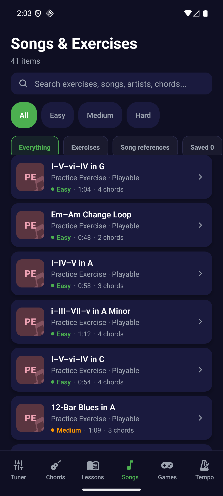

# StandardTune

A free and open source multi-instrument tuner and guitar learning companion for Android. No ads, no tracking, no in-app purchases.

## Screenshots

| Tuner | Chords | Anatomy lesson |
|---|---|---|
|  |  |  |

| Metronome | Lessons | Songs |
|---|---|---|
|  |  |  |

## Features

- **Real-time tuner** powered by [react-native-tuner-engine](https://www.npmjs.com/package/react-native-tuner-engine) — a native C++ pitch-detection pipeline (YIN / PYIN / cepstrum ensemble) running on a dedicated audio thread
- **36 tuning presets plus custom tunings** — guitars, 4/5/6-string bass, ukulele, mandolin, banjo, violin, viola, cello and chromatic mode; custom sets can be backed up as validated JSON
- **Single-string tuning** — tap a string to aim at it; green means dead on, amber within nine cents, red past ten
- **Difficult-room guidance** — quiet/normal/noisy input profiles, native median/EMA/hysteresis, brief sustain hold, pitch history, signal diagnostics, and selected-string overtone correction
- **Stage and strobe modes** — a high-contrast keep-awake stage display and an optional moving strobe meter
- **Tuner calibration** — persisted A4 reference from 430–450 Hz and a selectable ±1–5 cent in-tune window, with beginner-friendly tune-up/down directions
- **Chord library** — 36 chords with finger positions, diagrams that draw barres and slide up the neck, and tap-to-hear playback
- **Metronome** — 40–200 BPM, tap tempo, accented downbeats, 2/4 · 3/4 · 4/4 · 6/8, on a drift-corrected clock shared with the play-along drills
- **Lessons** — 19 structured lessons, including a four-part bass path and an interactive guitar-anatomy diagram and quiz
- **Songs & exercises** — 15 clearly labeled song chord references plus 26 playable CC0 exercises built from common progressions, scales and mechanical technique patterns; includes a moving chord/tab lane, section loops, 50–125% speed, beat guidance, transpose/capo planning, guide playback, favorites, a local setlist and microphone scoring
- **Play-along practice** — Guitar Hero-style drills that listen to your real guitar: pluck the directed string/fret or strum the directed chord, with an "any tone" beginner mode and a "full chord" mode that requires evidence of multiple chord tones before scoring a hit
- **Chord Quiz** — name the shape, pick the shape, or name what you hear, with distractors chosen to be the chords people actually mix up
- **Chord Changes** — the one-minute-changes exercise, counted off your actual playing
- **Ear, rhythm and fretboard trainers** — interval recognition, tap consistency, and standard-tuning note recall
- **Scale and picking challenges** — microphone-scored C-major and pentatonic runs using the same live practice engine as lessons
- **Progression Builder** — assemble, hear, save and recall original chord loops entirely on device
- **Accessible guidance** — optional left-handed chord diagrams, spoken in-tune cues, haptics and guided string auto-advance
- **Practice tracking** — time at the instrument, logged per day against a goal, with a streak
- Dark theme throughout

All eight practice tools are playable and store their best result locally.

## Development

Requires Node 20.19.4+ (or a compatible newer LTS release) and an Android
development environment (JDK 17, Android SDK).

```sh
npm install
npx expo run:android
```

Logic that does not need a device — the chord data, the play-along matcher,
the beat clock, the song library — is covered by unit tests:

```sh
npm test
npm run typecheck
```

Shipping a build to the closed testers is one command, which bumps the
Android version code, tags, and lets CI build and upload it:

```sh
npm run release
```

See [docs/PLAY-SUBMISSION.md](docs/PLAY-SUBMISSION.md) for the one-time
service-account setup that the upload step needs.

> **Note:** the tuner uses a native Turbo Module, so the app must be built as a
> development build — it will not work in Expo Go.

Useful scripts:

- `npm start` — Metro dev server
- `npm run bundle:check` — build the production Android JavaScript bundle without creating an APK
- `node scripts/generate-samples.js` — regenerate the instrument reference samples in `assets/audio/`

The tuner research, configuration rationale and physical-device release gate
are documented in [docs/TUNER-RESEARCH.md](docs/TUNER-RESEARCH.md).
The visual direction, community-review findings, feature priorities, and Play
Store picture plan are in [docs/STYLE-AND-FEATURE-GUIDE.md](docs/STYLE-AND-FEATURE-GUIDE.md).
The no-paywall product rules, learning references, and license boundaries are
documented in [docs/FREE-AND-OPEN-DESIGN.md](docs/FREE-AND-OPEN-DESIGN.md).

## Release builds

CI (`.github/workflows/build-release.yml`) builds an APK on every push to `main` and publishes a GitHub Release on `v*` tags.

Signed builds require four repository secrets: `KEYSTORE_BASE64`, `KEYSTORE_PASSWORD`, `KEY_ALIAS`, `KEY_PASSWORD` — see [docs/KEYSTORE-CI.md](docs/KEYSTORE-CI.md). Without them, CI still produces a debug-signed APK artifact, but no Release is published.

## Privacy

StandardTune collects no data. Microphone audio is processed on-device for pitch detection and never recorded or transmitted — see [PRIVACY.md](PRIVACY.md). Play Store submission notes live in [docs/PLAY-SUBMISSION.md](docs/PLAY-SUBMISSION.md).

## License

[MIT](LICENSE)
